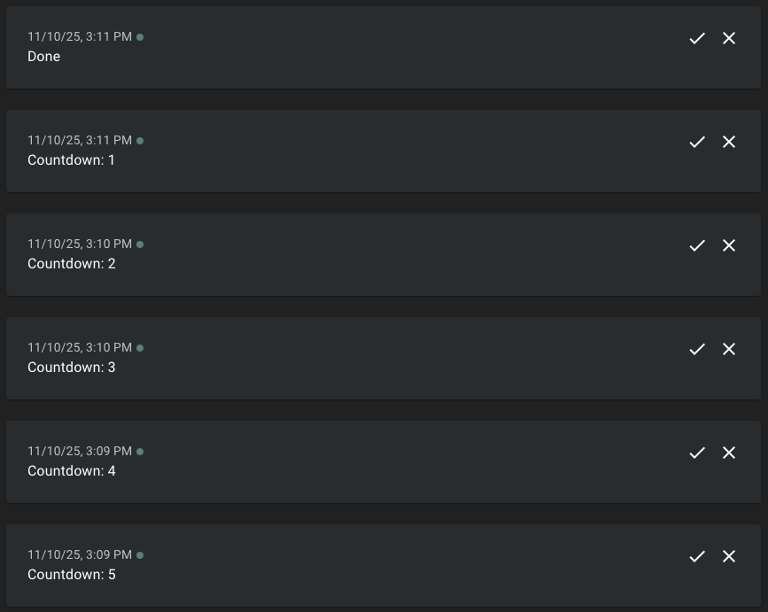

# Resonate Countdown on Google Cloud Functions

A *Countdown* powered by the Resonate Typescript SDK and Google Cloud Functions. The countdown sends periodic notifications to [ntfy.sh](https://ntfy.sh/) at configurable intervals.

## Behind the Scenes

The Countdown is implemented with Resonate's Durable Execution framework, Distributed Async Await. The Countdown is a simple loop that can sleep for hours, days, or weeks. On `yield ctx.sleep` the countdown function suspends (terminates), immediately completing the Google Cloud Function execution. After the specified delay, Resonate will resume (restart) the countdown function by triggering a new Google Cloud Function execution.

```typescript
export function* countdown(
	ctx: Context,
	count: number,
	delay: number,
	url: string,
) {
	for (let i = count; i > 0; i--) {
		// send notification to ntfy.sh
		yield* ctx.run(notify, url, `Countdown: ${i}`);
		// sleep creates a suspension point causing
		// the Google Cloud Function execution to terminate
		yield* ctx.sleep(delay * 60 * 1000);
	}
	// send the last notification to ntfy.sh
	yield* ctx.run(notify, url, `Done`);
}
```

**Key Concepts:**

- **Suspension and Resumption:** Executions can be suspended for any amount of time
---

# Running the Example

You can run the Countdown locally on your machine with Google's Functions Framework or you can deploy the Countdown to Google Cloud Platform.

## 1. Running Locally

### 1.1. Prerequisites

Install the Resonate Server & CLI with [Homebrew](https://docs.resonatehq.io/operate/run-server#install-with-homebrew) or download the latest release from [Github](https://github.com/resonatehq/resonate/releases).

```
brew install resonatehq/tap/resonate
```

### 1.2. Start Resonate Server

Start the Resonate Server. By default, the Resonate Server will listen at `http://localhost:8001`.

```
resonate dev
```

### 1.3. Setup the Countdown

Clone the repository

```
git clone https://github.com/resonatehq-examples/example-countdown-ts-gcp
cd example-countdown-ts-gcp
```

Install dependencies

```
npm install
```

### 1.4. Start the Countdown

Start the Google Cloud Function. By default, the Google Cloud Function will listen at `http://localhost:8080`.

```
npm run dev
```

### 1.5. Invoke the Countdown

The examples use ntfy.sh to send notifications. Create a unique channel name (to avoid receiving notifications from other users) and open the ntfy.sh channel in your browser.

```
echo https://ntfy.sh/resonatehq-$RANDOM
```

Start a countdown

```
resonate invoke <promise-id> --func countdown --arg <count> --arg <delay-in-minutes> --arg https://ntfy.sh/<channel> --target <function-url>
```

Example

```
resonate invoke countdown.1 --func countdown --arg 5 --arg 1 --arg https://ntfy.sh/resonatehq-22012 --target http://localhost:8080
```

### 1.6. Inspect the execution

Use the `resonate tree` command to visualize the countdown execution.

```
resonate tree countdown.1
```

Example output (while waiting on the second sleep):

```
countdown.1
├── countdown.1.0 🟢 (run)
├── countdown.1.1 🟢 (sleep)
├── countdown.1.2 🟢 (run)
└── countdown.1.3 🟡 (sleep)
```

## 2. Deploying to GCP

This section guides you through deploying the countdown example to Google Cloud Platform using Cloud Run for the Resonate server and Cloud Functions for the countdown function.

### 2.1 Prerequisites

#### Resonate

Install the Resonate CLI with [Homebrew](https://docs.resonatehq.io/operate/run-server#install-with-homebrew) or download the latest release from [Github](https://github.com/resonatehq/resonate/releases).

```
brew install resonatehq/tap/resonate
```

#### Google Cloud Platform

Ensure you have a [Google Cloud Platform](https://cloud.google.com/cloud-console) account, a project, and the necessary permissions as well as the [Google Cloud CLI](https://docs.cloud.google.com/sdk/docs/install) installed and configured.

> [!WARNING]
> Google Cloud Platform offers extensive configuration options. The instructions in this guide provide a baseline setup that you will need to adapt for your specific requirements, organizational policies, or security constraints.

### 2.2 Deploy the Resonate Server to Cloud Run

Deploy the Resonate Server with its initial configuration.

**Step 1: Initial deployment**

```
gcloud run deploy resonate-server \
  --image=resonatehqio/resonate:latest \
  --region=us-central1 \
  --allow-unauthenticated \
  --timeout=300 \
  --port=8080 \
  --min-instances=1 \
  --max-instances=1 \
  --args="serve,--api-http-addr=:8080"
```

**Step 2: Configuration**

Configure the Resonate Server with its URL.

```
export RESONATE_URL=$(gcloud run services describe resonate-server --region=us-central1 --format='value(status.url)')

gcloud run services update resonate-server \
  --region=us-central1 \
  --args="serve,--api-http-addr=:8080,--system-url=$RESONATE_URL"
```

Print the Resonate Server URL

```
echo $RESONATE_URL
```

To view the Resonate Server logs

```
gcloud run services logs read resonate-server --region=us-central1 --limit=50
```

### 2.3 Deploy the Countdown to Cloud Functions

Deploy the countdown function to Cloud Functions.

```
gcloud functions deploy countdown \
  --gen2 \
  --runtime=nodejs20 \
  --region=us-central1 \
  --source=. \
  --entry-point=handler \
  --trigger-http \
  --allow-unauthenticated
```

Get the function URL:

```
export FUNCTION_URL=$(gcloud functions describe countdown --gen2 --region=us-central1 --format='value(serviceConfig.uri)')
```

Print the Cloud Function URL

```
echo $FUNCTION_URL
```

To view the Cloud Function logs

```
gcloud functions logs read countdown --gen2 --region=us-central1 --limit=50
```

### 2.4 Invoke the Countdown

The examples use ntfy.sh to send notifications. Create a unique channel name (to avoid receiving notifications from other users) and open the ntfy.sh channel in your browser.

```
echo https://ntfy.sh/resonatehq-$RANDOM
```

Start a countdown

```
resonate invoke <promise-id> --func countdown --arg <count> --arg <delay-in-minutes> --arg https://ntfy.sh/<channel> --target $FUNCTION_URL --server $RESONATE_URL
```

Example

```
resonate invoke countdown.1 --func countdown --arg 5 --arg 1 --arg https://ntfy.sh/resonatehq-22012 --target $FUNCTION_URL --server $RESONATE_URL
```

### 2.5. Inspect the execution

Use the `resonate tree` command to visualize the countdown execution.

```
resonate tree countdown.1 --server $RESONATE_URL
```

Example output (while waiting on the second sleep):

```
countdown.1
├── countdown.1.0 🟢 (run)
├── countdown.1.1 🟢 (sleep)
├── countdown.1.2 🟢 (run)
└── countdown.1.3 🟡 (sleep)
```

### 2.6 Cleanup

Delete the deployed services:

```
# Delete the Cloud Function
gcloud functions delete countdown --gen2 --region=us-central1 --quiet

# Delete the Cloud Run service
gcloud run services delete resonate-server --region=us-central1 --quiet
```

## Troubleshooting

If everything is configured correctly, you will see notifications in your ntfy.sh workspace.



If you are still having trouble please [open an issue](https://github.com/resonatehq-examples/example-countdown-ts-gcp/issues).
